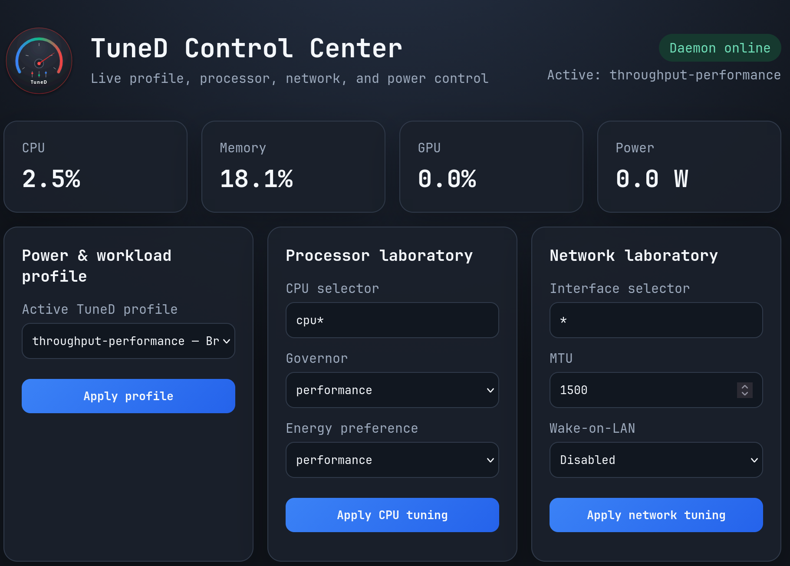

# tuned-rs

`tuned-rs` is a native Rust implementation of TuneD for Linux. It installs the
standard `tuned`, `tuned-adm`, and `tuned-ppd` command and service identities,
owns TuneD's system D-Bus API, and consumes existing TuneD profiles.

## Compatibility

- `com.redhat.tuned.control` D-Bus methods, signals, PolicyKit actions, and
  activation identity
- TuneD's optional JSON-RPC Unix socket and signal sockets
- `tuned-adm` profile, verification, plugin, and dynamic-instance commands
- power-profiles-daemon compatibility through `tuned-ppd`
- layered and stacked profiles under `/usr/lib/tuned/profiles` and
  `/etc/tuned/profiles`
- ordered variables, external variable files, nested `${f:...}` functions,
  conditional instances, device matching, and profile-local scripts
- transactional rollback across profile changes, shutdown, and failed applies
- upstream bootloader, CPU, disk, network, scheduler, sysctl, sysfs, VM,
  service, IRQ, USB, video, audio, ACPI, uncore, mount, and realtime controls
- dynamic disk, network, CPU, scheduler, and device-instance tuning

The dnf package provides and replaces both `tuned` and
`power-profiles-daemon`, so it can replace the Python packages without changing
callers or service names.

Fedora is the primary integration and release target. Install the package through the Sisyphus Copr repository.

## Control Center


Launch the interactive processor, network, power-profile, and telemetry UI
from the desktop application menu or a terminal:

```bash
tuned-rs-gui
```

The launcher creates a random loopback-only HTTP endpoint protected by a
192-bit per-session token, opens the default browser, and exits after the tab
has closed. Changes are applied through TuneD's transactional instance API.

## Install on Fedora

Install from the published Fedora repository:

```bash
sudo dnf install tuned-rs
sudo rustctl enable --now tuned-rs.service tuned-rs-ppd.service
```

The repository URL is configured by the Fedora release package. Local builds
are published through the `arachos` repository created during the Fedora build.

## Install on DNF/RPM based systems

The package is available in the Sisyphus Copr repository for DNF/RPM based systems.
Enable the repository and install the package:

```console
sudo dnf copr enable sisyphuscode/tuned-rs
sudo dnf remove tuned
sudo dnf install tuned-rs
sudo systemctl enable --now tuned-rs
sudo systemctl enable --now tuned-rs-ppd
```

To build from source:

```bash
sudo dnf install @development-tools rust cargo systemd-devel
make check
make test
sudo make install
sudo systemctl enable --now tuned.service
```

## Use

The standard TuneD commands work unchanged:

```bash
tuned-adm list
tuned-adm active
tuned-adm recommend
tuned-adm profile throughput-performance
tuned-adm verify
```

Power-profile-aware desktops can use the standard
`org.freedesktop.UPower.PowerProfiles` interface provided by `tuned-ppd`.

## Configuration

Global settings are read from `/etc/tuned/tuned-main.conf`, including daemon,
dynamic tuning, timing, rollback, profile directories, D-Bus, Unix socket,
instance priority, sysctl reapplication, and startup udev-settle controls.
Power-profile mappings are read from `/etc/tuned/ppd.conf`.

Bounded chaos analysis is enabled by default with `chaos_enabled = 1`. The
telemetry collector then reports Lorenz, Rössler, logistic-map, Mandelbrot,
Lyapunov, and Duffing features. These are finite, rate-limited advisory
signals; they do not write governors, sysfs values, or profiles. The profile
recommendation API may use the advisory signal after its history has warmed up.
When `chaos_auto_profile = 1`, the daemon can use that recommendation only in
auto mode, after three matching observations and a 60-second minimum dwell
period. Manual profiles are not changed. Set `chaos_enabled = 0` to disable
the analysis. The available limits are `chaos_window`, `chaos_dt`, and
`chaos_mandelbrot_iterations`, plus `chaos_confirmations` and
`chaos_min_dwell` for the guarded adaptive path.

The package installs administrator-editable realtime and CPU-partitioning
variable templates in `/etc/tuned`. Package upgrades preserve local edits.

Useful test-only overrides are:

- `TUNED_RS_ROOT`: prefix absolute system paths with a synthetic root
- `TUNED_RS_PROFILE_DIRS`: override the configured profile search path
- `TUNED_RS_CPUINFO_STRING` and `TUNED_RS_UNAME_STRING`: override conditions
- `RUST_LOG`: select the tracing filter

## Validation

```bash
cargo test --locked --all-targets
cargo clippy --locked --all-targets -- -D warnings
make packaging-check
make proofs-strict
```

The profile integration suite audits the complete bundled upstream profile set
and can audit another TuneD checkout through `TUNED_RS_UPSTREAM_PROFILES`.
Formal models are checked with Fortran, Idris 2, and Agda when those toolchains
are installed.

## License

GPL-2.0-or-later

## Author

Kenny Glauner (SisyphusAeolides)
